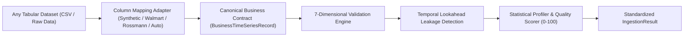

# GlassBox-BI

> **Explainable AI (XAI) & Decision Intelligence for Business Forecasting**

[](./PROJECT_STATE.md)
[](./LICENSE)
[](https://www.python.org/)
[](https://nextjs.org/)

---

## 📖 Overview

**GlassBox-BI** transforms black-box machine learning predictions into transparent, auditable, and actionable business intelligence.

GlassBox-BI is designed from the ground up as a **universal, organization-agnostic business intelligence framework**. It is strictly decoupled from any single retailer or vendor format. Rather than hard-coding Walmart or retail-specific features into core models, GlassBox-BI establishes a canonical business data contract and flexible column mapping adapters capable of supporting:
- Retail demand and sales forecasting
- Revenue and financial time-series modeling
- Inventory planning and stock-level projections
- SME cash-flow analysis
- Cross-industry tabular and time-series business data

> [!NOTE]
> *The synthetic dataset is a development/testing dataset. Real benchmark datasets such as Walmart and Rossmann will be integrated later without changing the core canonical data contract.*

---

## 🏛️ System Architecture

```
GlassBox-BI/
├── backend/                        # FastAPI Backend Application
│   ├── app/
│   │   ├── api/                    # Versioned REST APIs (/api/v1/)
│   │   │   └── v1/endpoints/       # Health, contracts, and dataset ingestion APIs
│   │   ├── core/                   # Config, settings, logging & CORS
│   │   ├── schemas/                # Canonical data contracts & Pydantic schemas
│   │   │   ├── data_contract.py    # BusinessTimeSeriesRecord & ColumnMapping
│   │   │   └── ingestion.py        # Validation, QualityScore, & IngestionResult
│   │   ├── data_processing/        # Ingestion, validation, profiling & quality
│   │   │   ├── ingestion.py        # Source-agnostic CSV ingestion service
│   │   │   ├── validation.py       # 7-dimensional data validation engine
│   │   │   ├── leakage.py          # Temporal lookahead leakage detector
│   │   │   ├── quality.py          # Explainable 0-100 data quality scorer
│   │   │   └── profiling.py        # Statistical dataset profiling service
│   │   ├── forecasting/            # Forecasting models boundary (Phase 4)
│   │   ├── explainability/         # XAI & SHAP attribution boundary (Phase 6)
│   │   ├── decision_intelligence/  # Scenario simulation boundary (Phase 7)
│   │   ├── agents/                 # Autonomous agents boundary (Phase 3+)
│   │   ├── orchestration/          # Multi-agent orchestrator boundary (Phase 8)
│   │   └── main.py                 # Application entrypoint & health checks
│   └── requirements.txt            # Backend dependencies
├── frontend/                       # Next.js 16 + TypeScript Dashboard
├── data/                           # Data directory tree
│   ├── raw/                        # Local raw datasets (Git ignored)
│   │   └── synthetic/              # 50,000-row synthetic retail dataset (local only)
│   ├── processed/                  # Preprocessed datasets (Git ignored)
│   └── sample/                     # Lightweight sample datasets (Git tracked)
│       └── retail_sample.csv       # 150-row verified representative sample
├── scripts/                        # Utility & data generation scripts
│   └── generate_synthetic_retail_data.py # Deterministic 50k dataset generator
├── tests/                          # Automated test suites (39 unit tests)
│   └── unit/
├── docs/                           # Architecture and roadmap documentation
│   ├── architecture.md             # System architecture blueprint
│   └── development_phases.md       # 13-Phase development roadmap
├── .env.example                    # Global environment variables template
├── .gitignore                      # Git ignore rules (raw data excluded)
├── CHANGELOG.md                    # Project change history
├── PROJECT_STATE.md                # Single source of truth for project state
└── README.md                       # Project documentation entry point
```

---

## 🔄 Universal Data Ingestion Flow



---

## 🚀 Getting Started

### 1. Prerequisites
- Python 3.10+
- Node.js v18+ & npm
- Git

### 2. Generate Synthetic Retail Dataset
Generate the deterministic 50,000-row synthetic retail dataset and the 150-row sample dataset:
```bash
python scripts/generate_synthetic_retail_data.py --rows 50000 --seed 42
```
Outputs:
- Full 50,000-row dataset: `data/raw/synthetic/retail_50k.csv` (excluded from Git)
- Sample 150-row dataset: `data/sample/retail_sample.csv` (tracked by Git)

### 3. Backend Setup & Run
```bash
# Setup Python virtual environment
python -m venv .venv
.venv\Scripts\activate       # Windows
# or source .venv/bin/activate  (Linux/macOS)

# Install dependencies
pip install -r backend/requirements.txt

# Run automated tests (39 tests)
pytest tests/

# Launch FastAPI development server
uvicorn backend.app.main:app --host 127.0.0.1 --port 8000 --reload
```

Key API endpoints:
- Root Health Check: `http://127.0.0.1:8000/health`
- Dataset Ingestion & Validation API: `http://127.0.0.1:8000/api/v1/datasets/sample-summary`
- Mapping Templates Discovery: `http://127.0.0.1:8000/api/v1/datasets/mapping-templates`
- Interactive OpenAPI Docs: `http://127.0.0.1:8000/docs`

### 4. Frontend Setup & Run
```bash
cd frontend
npm install
npm run dev
```
Open [http://localhost:3000](http://localhost:3000) to view the GlassBox-BI interactive dashboard shell.

---

## 🗺️ Phased Development Roadmap

| Phase | Focus | Status |
|---|---|---|
| **Phase 0** | **Project Foundation & Governance** | ✅ Completed |
| **Phase 1** | **Application Skeleton** | ✅ Completed |
| **Phase 2** | **Dataset Ingestion & Generic Data Foundation** | ✅ Completed |
| **Phase 3** | **Data Processing Agent** | ⏳ Next |
| **Phase 4** | **Forecasting Agent** | ⏳ Pending |
| **Phase 5** | **Forecast Evaluation** | ⏳ Pending |
| **Phase 6** | **Explainability Agent** | ⏳ Pending |
| **Phase 7** | **Decision Intelligence Agent** | ⏳ Pending |
| **Phase 8** | **Multi-Agent Orchestration** | ⏳ Pending |
| **Phase 9** | **Feedback & Self-Correction Loop** | ⏳ Pending |
| **Phase 10** | **Dashboard** | ⏳ Pending |
| **Phase 11** | **MLflow, Testing & Deployment** | ⏳ Pending |
| **Phase 12** | **Final Integration & Validation** | ⏳ Pending |

Detailed milestone specifications are documented in [`docs/development_phases.md`](docs/development_phases.md).

---

## 📋 Governance & Tracking

All project decisions, state transitions, and releases are tracked in:
- [`PROJECT_STATE.md`](PROJECT_STATE.md): Current phase, architectural decisions, testing status, and active instructions.
- [`CHANGELOG.md`](CHANGELOG.md): Detailed record of changes per release/phase.

---

## 👥 Authors & Academic Context

Developed as a Collaborative Major Project in Artificial Intelligence & Data Science.
- **Repository**: [ManthanBalla/GlassBox-BI](https://github.com/ManthanBalla/GlassBox-BI)
