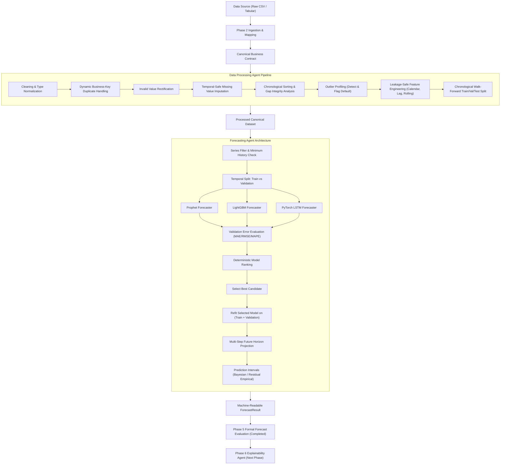

# GlassBox-BI

> **Explainable AI (XAI) & Decision Intelligence for Business Forecasting**

[](./PROJECT_STATE.md)
[](./LICENSE)
[](https://www.python.org/)
[](https://nextjs.org/)

---

## 📖 Overview

**GlassBox-BI** transforms black-box machine learning predictions into transparent, auditable, and actionable business intelligence.

GlassBox-BI is designed from the ground up as a **universal, organization-agnostic business intelligence framework**. It is strictly decoupled from any single retailer or vendor format. Rather than hard-coding Walmart or retail-specific features into core models, GlassBox-BI establishes a canonical business data contract, modular processing, and a model-agnostic forecasting layer capable of supporting:
- Retail demand and sales forecasting
- Revenue and financial time-series modeling
- Inventory planning and stock-level projections
- SME cash-flow analysis
- Cross-industry tabular and time-series business data

> [!IMPORTANT]
> **Core Decision & Forecasting Principles**:
> - *The Phase 7 Decision Intelligence Agent is a deterministic recommendation engine. It does not autonomously execute business actions.*
> - *Strict separation between Forecast Uncertainty (prediction interval spread) and Decision Confidence (calibrated recommendation trust score).*
> - *Zero Value Fabrication: Missing business context fields are never imputed or assumed; they automatically downgrade confidence, emit warnings, and trigger human supervisory review.*
> - *Benchmarked primarily on retail demand forecasting; architecturally extensible to SME cash-flow decision support.*

---

## 🏛️ System Architecture

```
GlassBox-BI/
├── backend/                        # FastAPI Backend Application
│   ├── app/
│   │   ├── api/                    # Versioned REST APIs (/api/v1/)
│   │   │   └── v1/endpoints/       # Health, contracts, processing, forecasting, evaluation, explainability, decisions
│   │   ├── core/                   # Config, settings, logging & CORS
│   │   ├── schemas/                # Canonical data contracts & Pydantic schemas
│   │   │   ├── data_contract.py    # BusinessTimeSeriesRecord & ColumnMapping
│   │   │   ├── ingestion.py        # Validation, QualityScore, & IngestionResult
│   │   │   ├── processing.py       # DataProcessingConfig, Audit, Split, & Result
│   │   │   ├── forecasting.py      # ForecastPoint, ForecastRequest, ForecastResult
│   │   │   ├── evaluation.py       # BenchmarkResult & ModelTestEvaluation
│   │   │   ├── explainability.py   # ExplanationResult, FeatureContribution, Fidelity
│   │   │   └── decisions.py        # BusinessContext, RecommendationItem, DecisionResult
│   │   ├── data_processing/        # Ingestion, validation, profiling, and processing agent
│   │   ├── forecasting/            # Forecasting models & agent (Phase 4)
│   │   ├── evaluation/             # Formal forecasting evaluation module (Phase 5)
│   │   ├── explainability/         # XAI & SHAP/LIME attribution module (Phase 6)
│   │   ├── decision_intelligence/  # Deterministic Prescriptive Decision Agent (Phase 7)
│   │   │   ├── base.py             # BaseDecisionEngine abstract interface
│   │   │   ├── rules.py            # RetailDecisionRuleEngine (8 deterministic rules)
│   │   │   ├── scoring.py          # DecisionScorer (confidence calibration & recommendation score)
│   │   │   ├── validation.py       # DecisionValidator (zero-fabrication & safety contracts)
│   │   │   └── agent.py            # DecisionIntelligenceAgent coordinator
│   │   ├── orchestration/          # Multi-agent orchestrator boundary (Phase 8)
│   │   └── main.py                 # Application entrypoint & health checks
│   └── requirements.txt            # Backend dependencies
├── frontend/                       # Next.js 16 + TypeScript Dashboard
│   └── src/components/             # ForecastingPanel, EvaluationPanel, ExplainabilityPanel, DecisionIntelligencePanel
├── data/                           # Data directory tree
├── scripts/                        # Utility & verification scripts
│   ├── verify_phase5_benchmark.py  # Holdout test set formal benchmark verification
│   ├── verify_phase6_explainability.py # Live verification for SHAP, LIME, and Prophet
│   └── verify_phase7_decisions.py  # Live verification for Decision Intelligence
├── tests/                          # Automated test suites (158 unit tests, 0 regressions)
│   └── unit/
└── docs/                           # Architecture and roadmap documentation
```

---

## 🔄 Architecture & Agent Workflow



---

## 🚀 Getting Started

### 1. Prerequisites
- Python 3.10+
- Node.js v18+ & npm
- Git

### 2. Generate and Process Synthetic Retail Dataset
Generate the deterministic 50,000-row synthetic retail dataset and process it:
```bash
# 1. Generate 50,000 synthetic rows (and 150-row sample)
python scripts/generate_synthetic_retail_data.py --rows 50000 --seed 42

# 2. Run Data Processing Agent pipeline (cleaning, imputation, lags, rolling features)
python scripts/process_retail_dataset.py

# 3. Run Phase 5 Formal Holdout Test Benchmark verification
python scripts/verify_phase5_benchmark.py
```
Outputs:
- Full 50,000-row raw dataset: `data/raw/synthetic/retail_50k.csv` (excluded from Git)
- Full 50,000-row processed dataset: `data/processed/synthetic/retail_processed.csv` (excluded from Git)
- Verified samples: `data/sample/retail_sample.csv`, `data/sample/retail_processed_sample.csv` (tracked by Git)

### 3. Backend Setup & Run
```bash
# Setup Python virtual environment
python -m venv .venv
.venv\Scripts\activate       # Windows
# or source .venv/bin/activate  (Linux/macOS)

# Install dependencies
pip install -r backend/requirements.txt

# Run automated tests (103 unit tests across all phases, 0 regressions)
pytest tests/

# Launch FastAPI development server
uvicorn backend.app.main:app --host 127.0.0.1 --port 8000 --reload
```

Key API endpoints:
- Root Health Check: `http://127.0.0.1:8000/health`
- Dataset Ingestion API: `http://127.0.0.1:8000/api/v1/datasets/sample-summary`
- Data Processing API: `http://127.0.0.1:8000/api/v1/process/sample-summary`
- Forecasting Health: `http://127.0.0.1:8000/api/v1/forecast/health`
- Forecasting Supported Models: `http://127.0.0.1:8000/api/v1/forecast/models`
- Forecasting Default Config: `http://127.0.0.1:8000/api/v1/forecast/config`
- Fast Sample Forecast: `http://127.0.0.1:8000/api/v1/forecast/sample?model=lightgbm&horizon=7`
- Run Forecasting Agent: `POST http://127.0.0.1:8000/api/v1/forecast/run`
- **Evaluation Health Check**: `http://127.0.0.1:8000/api/v1/evaluation/health`
- **Evaluation Metrics Documentation**: `http://127.0.0.1:8000/api/v1/evaluation/metrics`
- **Fast Demonstration Benchmark**: `http://127.0.0.1:8000/api/v1/evaluation/sample?horizon=14&models=prophet,lightgbm,lstm`
- **Run Formal Test Benchmark**: `POST http://127.0.0.1:8000/api/v1/evaluation/run`
- Interactive OpenAPI Docs: `http://127.0.0.1:8000/docs`

### 4. Frontend Setup & Run
```bash
cd frontend
npm install
npm run dev
```
Open [http://localhost:3000](http://localhost:3000) to view the GlassBox-BI interactive dashboard shell, Phase 4 forecasting panel, and Phase 5 holdout test-set benchmark panel.

---

## 🗺️ Phased Development Roadmap

| Phase | Focus | Status |
|---|---|---|
| **Phase 0** | **Project Foundation & Governance** | ✅ Completed |
| **Phase 1** | **Application Skeleton** | ✅ Completed |
| **Phase 2** | **Dataset Ingestion & Generic Data Foundation** | ✅ Completed |
| **Phase 3** | **Data Processing Agent** | ✅ Completed |
| **Phase 4** | **Forecasting Agent** | ✅ Completed |
| **Phase 5** | **Forecast Evaluation** | ✅ Completed |
| **Phase 6** | **Explainability Agent** | ⏳ Next |
| **Phase 7** | **Decision Intelligence Agent** | ⏳ Pending |
| **Phase 8** | **Multi-Agent Orchestration** | ⏳ Pending |
| **Phase 9** | **Feedback & Self-Correction Loop** | ⏳ Pending |
| **Phase 10** | **Dashboard** | ⏳ Pending |
| **Phase 11** | **MLflow, Testing & Deployment** | ⏳ Pending |
| **Phase 12** | **Final Integration & Validation** | ⏳ Pending |

Detailed milestone specifications are documented in [`docs/development_phases.md`](docs/development_phases.md).

---

## 📋 Governance & Tracking

All project decisions, state transitions, and releases are tracked in:
- [`PROJECT_STATE.md`](PROJECT_STATE.md): Current phase, architectural decisions, testing status, and active instructions.
- [`CHANGELOG.md`](CHANGELOG.md): Detailed record of changes per release/phase.

---

## 👥 Authors & Academic Context

Developed as a Collaborative Major Project in Artificial Intelligence & Data Science.
- **Repository**: [ManthanBalla/GlassBox-BI](https://github.com/ManthanBalla/GlassBox-BI)
