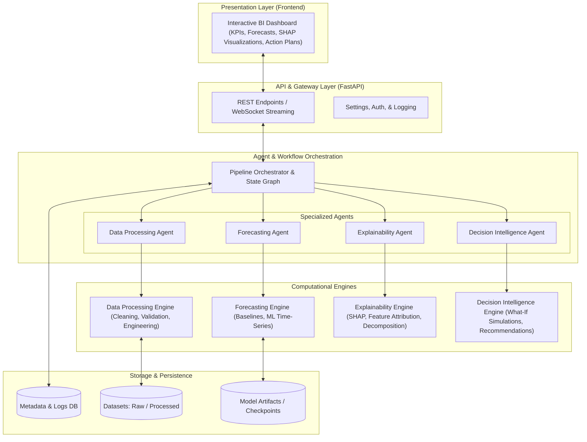

# GlassBox-BI — System Architecture Blueprint

## 1. Executive Summary & Vision

**GlassBox-BI** is an Explainable Artificial Intelligence (XAI) and Decision Intelligence platform engineered for transparent business forecasting. 

Traditional BI and machine learning forecasting pipelines often function as "black boxes" — producing numeric predictions without explaining *why* numbers move, *what drivers* cause the variation, or *what actionable decisions* leaders should make. GlassBox-BI bridges this trust deficit by pairing predictive modeling with explainability layers and collaborative agentic workflows, providing understandable, auditable, and actionable business insights.

---

## 2. High-Level Architecture

The platform is structured into modular layers, maintaining strict separation of concerns:



---

## 3. Core Module Boundaries & Responsibilities

### 3.1 Data Ingestion & Generic Data Foundation (`backend/app/data_processing` & `backend/app/schemas`)
- **Organization-Agnostic Design**: GlassBox-BI is strictly decoupled from specific vendors (such as Walmart or Rossmann). It operates on a universal canonical schema:
  $$\text{Any Business Dataset} \longrightarrow \text{Column Mapping Adapter} \longrightarrow \text{Canonical Contract} \longrightarrow \text{Validation / Quality / Profiling}$$
- **Canonical Business Data Contract (`BusinessTimeSeriesRecord`)**:
  - Required fields: `date`, `entity_id`, `target` (for supervised time-series forecasting).
  - Optional standard fields: `product_id`, `category`, `region`, `store_type`, `price`, `promotion`, `holiday`, `inventory`.
  - Dynamic `additional_features` preserving unmapped exogenous regressors.
- **Dataset-Specific Column Mapping Layer (`ColumnMapping`)**:
  - Pre-configured benchmark templates: `SYNTHETIC_RETAIL_MAPPING`, `WALMART_MAPPING_TEMPLATE` (`Date` $\rightarrow$ `date`, `Store` $\rightarrow$ `entity_id`, `Weekly_Sales` $\rightarrow$ `target`), `ROSSMANN_MAPPING_TEMPLATE` (`Date` $\rightarrow$ `date`, `Sales` $\rightarrow$ `target`, `Promo` $\rightarrow$ `promotion`).
  - Heuristic synonym auto-detection (`auto_detect_column_mapping`) for zero-configuration ingestion.
- **Multi-Dimensional Validation Engine (`DataValidator`)**:
  - Schema, null rates, duplicate rows/keys, date parseability, non-negative target verification, and series continuity.
- **Temporal Lookahead Leakage Detection (`TemporalLeakageDetector`)**:
  - Scans for future lookahead tokens (`future_`, `lead_`, `next_`), post-observation timestamps, and duplicate target columns.
  - Recommends strict chronological walk-forward splitting over random cross-validation.
- **Deterministic & Explainable Quality Scoring (`DataQualityScorer`)**:
  - Weighted composite score (0–100) across Schema, Missing Values, Duplicates, Temporal Integrity, Numeric Validity, and Consistency with audit deduction logs.
- **Statistical Data Profiling (`DataProfiler`)**:
  - Extracts descriptive statistics, percentiles (Q25, Q75, median), IQR outlier counts, unique cardinalities, and time frequency inference.
- **Synthetic Retail Benchmark Dataset**:
  - Deterministic 50,000-row synthetic retail dataset generated via `scripts/generate_synthetic_retail_data.py` (`seed=42`).
  - Raw 50,000-row file is strictly ignored by Git (`data/raw/`), while a 150-row representative sample (`data/sample/retail_sample.csv`) is versioned.
  - *The synthetic dataset is a development/testing dataset. Real benchmark datasets such as Walmart and Rossmann will be integrated later without changing the core canonical data contract.*

### 3.2 Data Processing Agent (`backend/app/data_processing/processing`)
- **Architectural Principle**: The Data Processing Agent is deterministic, vectorized, and auditable. It operates on the canonical contract and is completely decoupled from specific retailers.
- **Processing Architecture & Pipeline**:
  ```
                DATA SOURCE
                    ↓
          Phase 2 Ingestion
                    ↓
        Canonical Data Contract
                    ↓
          ┌─────────────────┐
          │ DATA PROCESSING │
          │     AGENT       │
          └────────┬────────┘
                   ↓
       ┌───────────────────────┐
       │ Cleaning              │
       │ Validation            │
       │ Missing Values        │
       │ Duplicate Handling    │
       │ Outlier Detection     │
       │ Temporal Integrity    │
       │ Feature Engineering   │
       │ Leakage Prevention    │
       └───────────┬───────────┘
                   ↓
          Processing Audit
                   ↓
          Forecasting-Ready
              Dataset
                   ↓
              Phase 4
  ```
- **Zero Lookahead Leakage Guarantee**:
  - **Calendar features**: Derived exclusively from the observation date $t$.
  - **Strictly historical lag features**: $\text{lag}_k(t) = y(t - k)$ for $k \in \{1, 7, 14, 28\}$. At index $t$, only past values are observed.
  - **Shifted rolling window moments**: $\text{rolling\_mean}_w(t) = \frac{1}{w} \sum_{i=1}^{w} y(t - i)$ via `shift(1).rolling(w)`. Current observation $y(t)$ is mathematically excluded from rolling stats at date $t$.
- **Outlier Philosophy**:
  - *GlassBox-BI does not automatically remove every statistical outlier. Business spikes may represent genuine events such as promotions or holidays, therefore the default behavior is detection and flagging (`target_outlier = 1`).*
- **Missing Value Handling**:
  - Entity-grouped medians or forward-fill for numeric features. Mode or explicit `"Unknown"` for categoricals.
  - **Target Safety**: Historical missing targets are never imputed from future data (dropped by default).
- **Chronological Walk-Forward Splitting**:
  - Pure data preparation utility (`TimeSeriesSplitter`) partitioning dataset chronologically (e.g. 70% train, 15% validation, 15% test) without random shuffling or premature model training.
- **Explainable Audit Trail**:
  - Every transformation records a `ProcessingAuditEntry` documenting the operation, column, rows affected, algorithmic strategy, and before/after summaries.

### 3.3 Forecasting Agent & Engine (`backend/app/forecasting`)
- **Architectural Principle**: Model-agnostic forecasting layer operating on the processed canonical dataset. Decoupled from specific models via `BaseForecastModel`.
- **Core Research Stance**:
  > *GlassBox-BI does not assume a single forecasting algorithm is universally optimal. The Forecasting Agent compares candidate models for the selected dataset/series and configuration.*
  > *Phase 4 uses validation data for internal model selection. The holdout test set is strictly reserved for formal evaluation in Phase 5.*
- **Forecasting Agent Flow**:
  ```
                    PHASE 3
               PROCESSED DATA
                      │
                      ▼
            ┌────────────────────┐
            │ FORECASTING AGENT  │
            └─────────┬──────────┘
                      │
            Candidate Models
                      │
         ┌────────────┼────────────┐
         ▼            ▼            ▼
      Prophet      LightGBM       LSTM
         │            │            │
         └────────────┼────────────┘
                      ▼
               Validation Metrics
                      │
                      ▼
               Model Ranking
                      │
                      ▼
               Selected Model
                      │
                      ▼
            Future Forecast + 
            Prediction Interval
                      │
                      ▼
                PHASE 5
           Formal Evaluation
                      │
                      ▼
                PHASE 6
            Explainability
  ```
- **Candidate Forecasters**:
  - **Prophet (`ProphetForecaster`)**: Statistical additive model handling non-linear trend and multi-period seasonality; native Bayesian uncertainty bounds.
  - **LightGBM (`LightGBMForecaster`)**: Fast gradient-boosted tree model using calendar and historical lag/rolling features. **Zero-Leakage Multi-Step Recursive Forecasting**: dynamically feeds previous model predictions into future lag vectors without future target lookahead.
  - **PyTorch LSTM (`LSTMForecaster`)**: Sequence-to-one recurrent neural network with early stopping. **Strict Scaler Isolation**: standard scaling parameters are fitted solely on historical training data.
- **Model Failure Isolation**: If an individual candidate encounters an exception or fails history requirements, the agent isolates the failure, logs the error in `ModelEvaluationScore`, and completes competition among healthy candidates.
- **Prediction Intervals**: Transparent uncertainty bounds (native Prophet Bayesian intervals; empirical validation-residual intervals for LightGBM and LSTM).
- **Model Checkpoint Persistence**: Checkpoint serialization to `models/saved/<model_name>/` via `save_forecaster` and safe deserialization via `load_forecaster`.

### 3.4 Formal Forecasting Evaluation Module (`backend/app/evaluation`) (Phase 5)
- **Architectural Principle**: Formal quantitative evaluation layer operating strictly on the untouched holdout test partition. Decoupled from model selection and tuning.
- **Academic & Research Stance**:
  > *Phase 4 performs model selection based exclusively on Validation MAE.*
  > *Phase 5 evaluates candidate models on the holdout Test partition as an independent, reproducible scientific benchmark.*
  > *Test-set metrics are reported independently and NEVER modify or override model selection.*
- **Evaluation Architecture & Workflow**:
  ```
                 CANONICAL DATASET
                         │
                         ▼
             Chronological Split (70/15/15)
             ┌───────────┬───────────┐
             ▼                       ▼
      [Train + Validation]      [Holdout Test Set]
             │                       │
             ▼                       │
     Phase 4 Selection               │
    (Validation MAE Winner)          │
             │                       │
             ▼                       ▼
       Fitted Models        Formal Test Evaluator
   (Prophet, LGBM, LSTM)             │
             │                       │
             └───────────┬───────────┘
                         ▼
             Quantitative Test Metrics
                (MAE, RMSE, MAPE)
                         │
                         ▼
             Formal Benchmark Report
  ```
- **Metric Definitions & Mathematical Rigor**:
  - **Mean Absolute Error (MAE)**:
    $$\text{MAE} = \frac{1}{n} \sum_{i=1}^n |y_i - \hat{y}_i|$$
  - **Root Mean Squared Error (RMSE)**:
    $$\text{RMSE} = \sqrt{\frac{1}{n} \sum_{i=1}^n (y_i - \hat{y}_i)^2}$$
  - **Mean Absolute Percentage Error (MAPE)**:
    $$\text{MAPE} = \frac{100}{n_{\text{valid}}} \sum_{i: |y_i| > 10^{-7}} \left| \frac{y_i - \hat{y}_i}{y_i} \right|$$
  - **Zero-Target Handling Strategy**: When ground-truth targets are zero ($y_i = 0$), division by zero is mathematically undefined. GlassBox-BI excludes zero-target observations from MAPE while explicitly tracking and reporting `zero_target_count` for full audit transparency.
- **Core Invariants & Guarantees**:
  1. **Strict Test Set Isolation**: Holdout test targets are never passed into model fitting (`fit()`), feature engineering, or hyperparameter selection.
  2. **Model Selection Decoupling**: Phase 4 validation winner (`lightgbm`) is independently preserved; `test_set_used_for_selection` is guaranteed `False` in all results.
  3. **Zero Lookahead Contamination**: Multi-step test forecasts generate lags recursively from previous predictions rather than ground truth test targets.
  4. **Reproducibility**: Deterministic seeding (`seed=42`) guarantees repeatable benchmark evaluations.
- **Empirical Benchmark on Synthetic Retail 50K Dataset** (`STORE_001` / `PROD_001`, 14-day holdout):
  - **LightGBM**: Test MAE = `1.7051`, Test RMSE = `2.7491`, Test MAPE = `7.40%` (Phase 4 Validation Winner: Val MAE `1.8736`)
  - **Prophet**: Test MAE = `2.3206`, Test RMSE = `2.7221`, Test MAPE = `11.12%` (Val MAE `2.3711`)
  - **PyTorch LSTM**: Test MAE = `2.6528`, Test RMSE = `3.4797`, Test MAPE = `12.66%` (Val MAE `1.9655`)

### 3.5 Explainability Agent (`backend/app/explainability`) (Phase 6 - Completed)
- **Glass-Box Principle**: Ensures every point forecast is accompanied by mathematical feature attributions and fidelity metrics.
- **Model-Specific Explainability Strategy**:
  - **LightGBM (Gradient Boosted Trees)**:
    - *SHAP*: Native `shap.TreeExplainer` providing exact, efficient Shapley values across tabular calendar, lag, rolling, and business regressors.
    - *LIME*: `lime.lime_tabular.LimeTabularExplainer` generating local linear surrogates with reproducible random seeds.
    - *Global Importance*: Mean absolute SHAP value: $\frac{1}{N} \sum_{i=1}^N |\phi_{ij}|$.
  - **PyTorch LSTM (Recurrent Sequence Neural Network)**:
    - *Lookback Sequence Attribution*: Explains the univariate historical target sequence (`lag_1` to `lag_{lookback}`). Does *not* fabricate tabular calendar/business features since the model consumes strictly target sequences.
    - *Model-Agnostic Sampling*: Lightweight background reference distribution sampled strictly from training sequences.
  - **Prophet (Generalized Additive Model)**:
    - *Additive Component Decomposition*: Interprets forecasts mathematically through `trend`, `weekly_seasonality`, `yearly_seasonality`, and `holiday_effects`.
    - *Scientific Honesty*: Formally reports `explanation_method = "component_based"` rather than fabricating pseudo-tabular SHAP values.
- **Local vs. Global Interpretability**:
  - *Local*: Answers *"Why did the model produce THIS specific forecast?"*, decomposing point predictions into positive drivers, negative drivers, and base values.
  - *Global*: Answers *"What generally drives this forecasting model across the dataset?"*, ranking features by aggregate importance.
- **Explanation Fidelity & Quality Metrics**:
  - Additive Reconstruction Error: $|\hat{y} - (\text{base\_value} + \sum \phi_i)|$.
  - Fidelity Score: $\max\left(0, 1 - \frac{\text{error}}{|\hat{y}| + 10^{-6}}\right)$.
  - LIME Local Surrogate $R^2$ goodness-of-fit.
- **Model Immutability & Zero Data Leakage**:
  - *Immutability*: Model weights, trees, historical buffers, and scalers are snapshotted pre-explanation and verified identical post-explanation.
  - *Zero Leakage*: Background distributions are sampled strictly from historical training partitions (`train_df`). Test-set targets are never used for explanations.

### 3.6 Decision Intelligence Module (`backend/app/decision_intelligence`) (Phase 7)
- **Scenario Simulation**: "What-if" analysis allowing business users to simulate driver adjustments (e.g., price increase, marketing spend shift).
- **Prescriptive Insights**: Translates forecast gaps and key drivers into human-readable strategic recommendations.
- **Risk Quantification**: Confidence bounds and scenario volatility metrics.

### 3.7 Multi-Agent Orchestration Module (`backend/app/orchestration`) (Phase 8)
- **Controlled Stateful Pipeline**:
  - `BaseOrchestrator` & `MultiAgentOrchestrator`: Coordinates the completed Phase 3–7 modules into a deterministic, stateful, auditable end-to-end workflow without replacing agent internals.
  - `SequentialWorkflowExecutor`: Executes stages strictly in topological order:
    $$\text{DATA\_PROCESSING} \longrightarrow \text{FORECASTING} \longrightarrow \text{EVALUATION} \longrightarrow \text{EXPLAINABILITY} \longrightarrow \text{DECISION\_INTELLIGENCE}$$
- **Explicit Agent Registry (`AgentRegistry`)**:
  - Maps `PipelineStage` enums directly to concrete agent implementations (`GenericBusinessDataProcessor`, `GenericForecastingAgent`, `FormalForecastEvaluator`, `ExplainabilityAgent`, `DecisionIntelligenceAgent`).
  - Extensible architecture without arbitrary or unsafe dynamic class loading.
- **Workflow State & Execution Contract**:
  - `OrchestrationState`: Strongly typed state container tracking `workflow_id`, `status` (`PENDING`, `RUNNING`, `COMPLETED`, `FAILED`, `PARTIAL`), `current_stage`, `completed_stages`, `failed_stages`, `skipped_stages`, `stage_results`, `warnings`, `errors`, and `execution_summary`.
  - `StageExecutionResult`: Independently auditable execution record documenting stage status, start/end timestamps, duration in ms, outputs, warnings, and domain metadata.
- **Error Isolation & Blocking Failure Policy**:
  - *Data Processing Failure*: Halts downstream execution immediately. Status: `FAILED`. Downstream stages skipped.
  - *Forecasting Failure*: Halts downstream execution immediately. Status: `FAILED`. Explainability and decision stages skipped.
  - *Evaluation Failure*: Recorded as failed; does not fabricate metrics; downstream stages proceed if requested. Status: `PARTIAL`.
  - *Explainability Failure*: Preserves forecast and evaluation; Decision Intelligence proceeds under explicit missing-explanation policy with confidence penalty and mandatory human review. Status: `PARTIAL`.
  - *Decision Intelligence Failure*: Preserves all earlier outputs. Status: `PARTIAL`.
- **Workflow Audit Trail (`audit.py`)**:
  - Immutable audit records documenting workflow ID, start/end timestamps, stage sequence, stage durations, selected model, horizon, explanation method, recommendation count, and final status.
- **Strict Phase 8 vs Phase 9 Boundary**:
  - *Zero Self-Correction*: Phase 8 does NOT implement feedback loops, automatic model retraining, automatic model re-selection, forecast rejection retry, or continuous learning.
  - *Zero LLM Dependency*: Execution is 100% deterministic Python code.
  - *"Phase 8 coordinates the existing agents but does not implement feedback-driven self-correction."*

### 3.8 API & Contract Layer (`backend/app/api` & `backend/app/schemas`)
- **FastAPI Engine**: Asynchronous ASGI backend handling high-concurrency requests with automatic OpenAPI interactive documentation (`/docs`).
- **Versioned API Structure**: Endpoints are mounted under `/api/v1/` through a centralized router aggregator (`api_router`).
- **Pydantic v2 Schema Contracts**: Clean type-safe data transfer objects decoupling the frontend from computational engines:
  - `HealthResponse`: Diagnostics, versioning, and status metrics (`/health`, `/api/v1/health`).
  - `DatasetMetadata`: Metadata for ingested business datasets (Phase 2).
  - `ForecastRequest` & `ForecastResult`: Forecasting invocation and prediction payloads (Phase 4).
  - `ExplanationResult`: SHAP attribution and signal decomposition results (Phase 6).
  - `RecommendationResult`: Prescriptive action items and simulation scenarios (Phase 7).
- **CORS & Resilience**: Configured for local development (`localhost:3000`), with global exception handlers preventing internal stack trace exposure.

### 3.8 Frontend Presentation Layer (`frontend/`)
- **Next.js App Router & TypeScript**: Reactive web application rendering server and client components.
- **Glassmorphic UI**: Tailored dark-mode interface with vibrant neon accents and responsive flex layouts.
- **Frontend-to-Backend Highway**: Asynchronous client-side data fetching targeting `${NEXT_PUBLIC_API_URL}` with live latency measurement.
- **Resilient Connectivity Monitoring**: Visual status pills (`Connected`, `Checking...`, `Unavailable`) with graceful fallback states and retry mechanisms.

---

## 4. Architectural Principles for Collaborative Student Development

1. **Modularity First**: Modules communicate through explicit Python interfaces and typed Pydantic models. No direct hidden dependencies between engines.
2. **Minimal Initial Complexity**: Avoid over-engineering. Build lightweight, verified components before adding complex agentic graphs or heavy deep learning models.
3. **Reproducibility**: Environment variables are strictly centralized (`.env.example`), and dependencies are pinned in `requirements.txt`.
4. **Transparent Governance**: Every phase is tracked via `PROJECT_STATE.md` and `CHANGELOG.md` with continuous test coverage in `tests/`.
