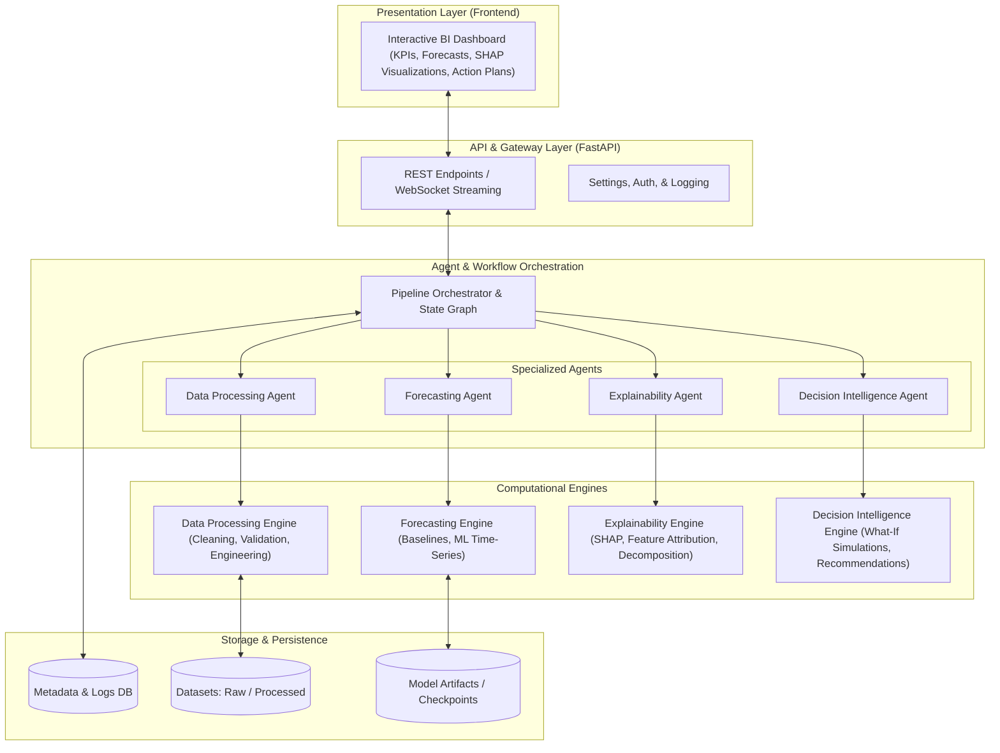

# GlassBox-BI — System Architecture Blueprint

## 1. Executive Summary & Vision

**GlassBox-BI** is an Explainable Artificial Intelligence (XAI) and Decision Intelligence platform engineered for transparent business forecasting. 

Traditional BI and machine learning forecasting pipelines often function as "black boxes" — producing numeric predictions without explaining *why* numbers move, *what drivers* cause the variation, or *what actionable decisions* leaders should make. GlassBox-BI bridges this trust deficit by pairing predictive modeling with explainability layers and collaborative agentic workflows, providing understandable, auditable, and actionable business insights.

---

## 2. High-Level Architecture

The platform is structured into modular layers, maintaining strict separation of concerns:

---

## 3. Core Module Boundaries & Responsibilities

### 3.1 Data Ingestion & Generic Data Foundation (`backend/app/data_processing` & `backend/app/schemas`)
- **Organization-Agnostic Design**: GlassBox-BI is strictly decoupled from specific vendors (such as Walmart or Rossmann). It operates on a universal canonical schema:
  $$\text{Any Business Dataset} \longrightarrow \text{Column Mapping Adapter} \longrightarrow \text{Canonical Contract} \longrightarrow \text{Validation / Quality / Profiling}$$
- **Canonical Business Data Contract (`BusinessTimeSeriesRecord`)**:
  - Required fields: `date`, `entity_id`, `target` (for supervised time-series forecasting).
  - Optional standard fields: `product_id`, `category`, `region`, `store_type`, `price`, `promotion`, `holiday`, `inventory`.
  - Dynamic `additional_features` preserving unmapped exogenous regressors.
- **Dataset-Specific Column Mapping Layer (`ColumnMapping`)**:
  - Pre-configured benchmark templates: `SYNTHETIC_RETAIL_MAPPING`, `WALMART_MAPPING_TEMPLATE` (`Date` $\rightarrow$ `date`, `Store` $\rightarrow$ `entity_id`, `Weekly_Sales` $\rightarrow$ `target`), `ROSSMANN_MAPPING_TEMPLATE` (`Date` $\rightarrow$ `date`, `Sales` $\rightarrow$ `target`, `Promo` $\rightarrow$ `promotion`).
  - Heuristic synonym auto-detection (`auto_detect_column_mapping`) for zero-configuration ingestion.
- **Multi-Dimensional Validation Engine (`DataValidator`)**:
  - Schema, null rates, duplicate rows/keys, date parseability, non-negative target verification, and series continuity.
- **Temporal Lookahead Leakage Detection (`TemporalLeakageDetector`)**:
  - Scans for future lookahead tokens (`future_`, `lead_`, `next_`), post-observation timestamps, and duplicate target columns.
  - Recommends strict chronological walk-forward splitting over random cross-validation.
- **Deterministic & Explainable Quality Scoring (`DataQualityScorer`)**:
  - Weighted composite score (0–100) across Schema, Missing Values, Duplicates, Temporal Integrity, Numeric Validity, and Consistency with audit deduction logs.
- **Statistical Data Profiling (`DataProfiler`)**:
  - Extracts descriptive statistics, percentiles (Q25, Q75, median), IQR outlier counts, unique cardinalities, and time frequency inference.
- **Synthetic Retail Benchmark Dataset**:
  - Deterministic 50,000-row synthetic retail dataset generated via `scripts/generate_synthetic_retail_data.py` (`seed=42`).
  - Raw 50,000-row file is strictly ignored by Git (`data/raw/`), while a 150-row representative sample (`data/sample/retail_sample.csv`) is versioned.
  - *The synthetic dataset is a development/testing dataset. Real benchmark datasets such as Walmart and Rossmann will be integrated later without changing the core canonical data contract.*

### 3.2 Forecasting Module (`backend/app/forecasting`)
- **Predictive Modeling**: Combines statistical baselines (e.g., ARIMA/ETS) and modern machine learning models (e.g., LightGBM/XGBoost, Prophet).
- **Evaluation**: Computes standardized time-series metrics (MAE, RMSE, MAPE, WAPE).
- **Artifacts**: Serializes and tracks model artifacts and metadata.

### 3.3 Explainability Module (`backend/app/explainability`)
- **Glass-Box Principle**: Ensures every forecast is accompanied by interpretability metadata.
- **Feature Attribution**: Global and local feature attributions using SHAP (SHapley Additive exPlanations) and surrogate models.
- **Time-Series Decomposition**: Separates signals into trend, seasonality, cyclical effects, and residual noise.

### 3.4 Decision Intelligence Module (`backend/app/decision_intelligence`)
- **Scenario Simulation**: "What-if" analysis allowing business users to simulate driver adjustments (e.g., price increase, marketing spend shift).
- **Prescriptive Insights**: Translates forecast gaps and key drivers into human-readable strategic recommendations.
- **Risk Quantification**: Confidence bounds and scenario volatility metrics.

### 3.5 Agent Layer & Multi-Agent Orchestration (`backend/app/agents` & `backend/app/orchestration`)
- **Role-Based Agents**:
  - *Data Processing Agent*: Audits dataset quality and recommends transformations.
  - *Forecasting Agent*: Selects optimal models, tunes parameters, and validates performance.
  - *Explainability Agent*: Formulates narrative explanations around feature attributions.
  - *Decision Intelligence Agent*: Evaluates simulated scenarios and drafts executive decision memos.
- **Orchestration**: Manages the multi-agent graph, state transitions, human-in-the-loop approvals, and self-correction loops.

### 3.6 API & Contract Layer (`backend/app/api` & `backend/app/schemas`)
- **FastAPI Engine**: Asynchronous ASGI backend handling high-concurrency requests with automatic OpenAPI interactive documentation (`/docs`).
- **Versioned API Structure**: Endpoints are mounted under `/api/v1/` through a centralized router aggregator (`api_router`).
- **Pydantic v2 Schema Contracts**: Clean type-safe data transfer objects decoupling the frontend from computational engines:
  - `HealthResponse`: Diagnostics, versioning, and status metrics (`/health`, `/api/v1/health`).
  - `DatasetMetadata`: Metadata for ingested business datasets (Phase 2).
  - `ForecastRequest` & `ForecastResult`: Forecasting invocation and prediction payloads (Phase 4).
  - `ExplanationResult`: SHAP attribution and signal decomposition results (Phase 6).
  - `RecommendationResult`: Prescriptive action items and simulation scenarios (Phase 7).
- **CORS & Resilience**: Configured for local development (`localhost:3000`), with global exception handlers preventing internal stack trace exposure.

### 3.7 Frontend Presentation Layer (`frontend/`)
- **Next.js App Router & TypeScript**: Reactive web application rendering server and client components.
- **Glassmorphic UI**: Tailored dark-mode interface with vibrant neon accents and responsive flex layouts.
- **Frontend-to-Backend Highway**: Asynchronous client-side data fetching targeting `${NEXT_PUBLIC_API_URL}` with live latency measurement.
- **Resilient Connectivity Monitoring**: Visual status pills (`Connected`, `Checking...`, `Unavailable`) with graceful fallback states and retry mechanisms.

---

## 4. Architectural Principles for Collaborative Student Development

1. **Modularity First**: Modules communicate through explicit Python interfaces and typed Pydantic models. No direct hidden dependencies between engines.
2. **Minimal Initial Complexity**: Avoid over-engineering. Build lightweight, verified components before adding complex agentic graphs or heavy deep learning models.
3. **Reproducibility**: Environment variables are strictly centralized (`.env.example`), and dependencies are pinned in `requirements.txt`.
4. **Transparent Governance**: Every phase is tracked via `PROJECT_STATE.md` and `CHANGELOG.md` with continuous test coverage in `tests/`.
